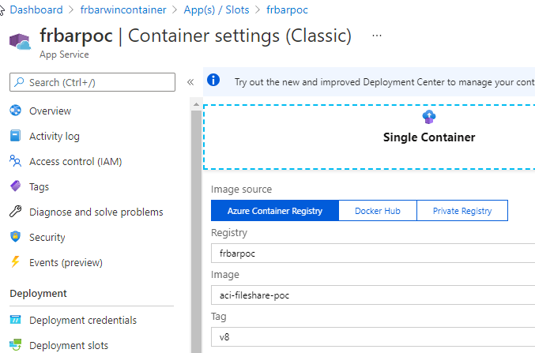
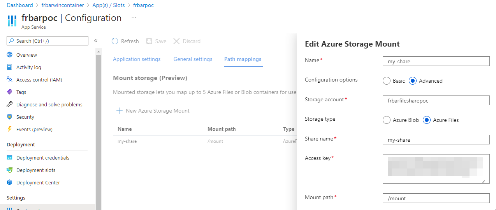
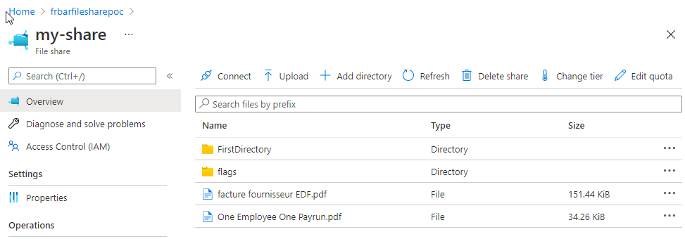
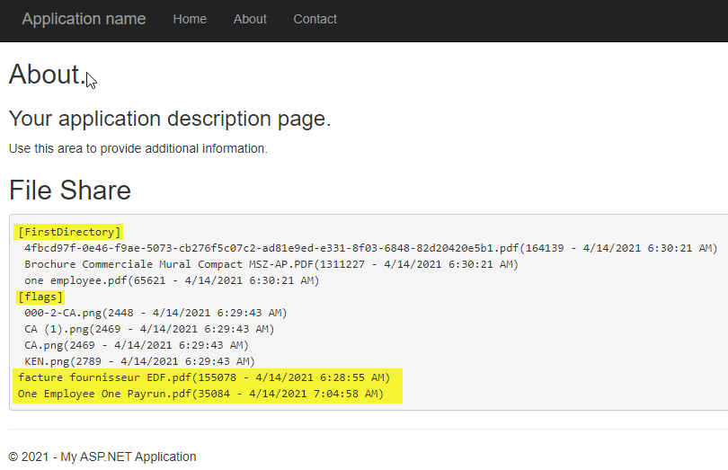

# Azure App Service with Windows Container and File Share

> Feature is in preview at the moment (2021-04-14) and requires Premium V3 app service.

## Pre-requisities
In Azure subscription:
- Azure Container Registry
- Azure Storage Account

On local:
- VS 2019 + .NET Framework 4.8
- Docker for Windows
- [az cli](https://docs.microsoft.com/fr-fr/cli/azure/install-azure-cli-windows?tabs=azure-powershell#install-or-update)

## Build Docker Image

In VS 2019, build the solution and publish it to folder: `bin\app.publish`

Using Windows Terminal, from `Frbar.Azure.WinContainerFileShare.Api` folder:
```
docker build . -t aci-fileshare-poc
docker images
docker run -d -p 8080:80 aci-fileshare-poc
````

Check that the app is up and running by browsing http://localhost:80.


## Push Docker Image

```
az login
az account set --subscription "<MSDN subscription ID>"
az acr login --name "<Azure Container Registry Name>"
docker tag <Azure Container Registry Name>.azurecr.io/aci-fileshare-poc:v1
docker push <Azure Container Registry Name>.azurecr.io/aci-fileshare-poc:v1
```

## Run the Container

- From the Azure portal, create an Azure App Service with Windows Container using the pushed image. It has to be Premium Tier, V3.



- Mount the File Share with mount path '/mount' (will be `c:/mount` from the application perspective). 



## Accessing the File Share

Using the standard .net API, files/directories can be accessed like from any local directory.





## Documentation

- [Tutorial: Create an Azure container registry and push a container image](https://docs.microsoft.com/en-us/azure/container-instances/container-instances-tutorial-prepare-acr)
- [Access Azure Storage (preview) as a network share from a container in App Service](https://docs.microsoft.com/en-us/azure/app-service/configure-connect-to-azure-storage?pivots=container-windows#link-storage-to-your-app)
- [Things You Should Know - App Service Windows Container](https://github.com/Azure/app-service-windows-containers/wiki/things-you-should-know)
